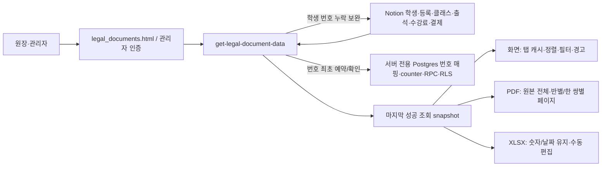

# 관리자 서류 출력 — 현재 구현·운영 계약

이 문서는 현재 동작과 데이터 계약을 설명한다. 과거 작업 로그가 아니다. 운영 사용법은 Notion 메뉴얼의 **관리자 서류 출력**, 관계/접근 구조는 **구조도**를 기준으로 한다. 고객 워크스페이스의 AI도 구현 완료와 미구현/확인 보류를 구분해야 한다.

## 1. 실행 경로와 인증

`legal_documents.html` → 관리자 키 검증 `get-legal-document-data` → Notion data source API(2025-09-03) → 조회 snapshot → 화면/인쇄/PDF/ExcelJS XLSX.

- 클래스만 최초 로딩. `action:classes`로 내부 클래스명과 신고명, `action:students + classId`로 선택 반의 실제 학생 이름을 조회한다.
- 조회 요청 `docType`은 `attendance`, `student-register`, `receipt-ledger`, `cash-journal`. 날짜와 classId/studentId/search는 서버 조회 조건이다.
- 관리자 인증을 유지한다. 주소·연락처·생년월일은 학부모 공개 API에 노출하지 않는다. 관리자 키/Notion 토큰/service role key는 문서·HTML·Git에 저장하지 않는다.
- 화면 조건을 바꾸기만 해서는 기존 snapshot이 변경되지 않는다. 내보내기 자료·파일명은 마지막 성공 조회 기준이다.
- 조회가 최초 번호 발급·학생 번호 Notion 보완을 할 수 있으므로 완전한 read-only 작업이라고 설명하지 않는다.

### 데이터 흐름 / 신뢰 경계

출력 파일 수정은 Notion으로 역동기화되지 않는다. 화면 정렬/필터는 출력 자료를 바꾸지 않는다. 공개 학부모 API와 관리자 서류 API는 별도 경로다.

## 2. 데이터 원본과 의미

| 출력 | 원본 |
| --- | --- |
| 학생 이름 | 학생 DB 제목 `학생이름`. 등록 제목에서 잘라 추정하지 않음 |
| 주소/생년월일 | 학생 DB의 실제 속성 |
| 대장 전화번호 | 학생 → 지정 우선 보호자 → 나머지 어머니/아버지/기타 보호자 순 → 누락 경고 |
| 신고 반명/과목 | 클래스 `신고 교습과정명` / `과목`. 내부 클래스명은 선택 목록용 |
| 입원/퇴원 | 등록 `등록일` / `종료일`. 대장/출석부는 조회기간과 수강기간 겹침 기준 |
| 교습비 | 연결된 수강료 `청구금액.formula.number` |
| 실제 결제금액 | 결제 `결제 금액.number` |
| 기타경비 | 이번 출력용 숫자 0. 원본 DB 값을 덮어쓰지 않음 |
| 교습기간/연월 | 수강료 `청구기간`. 결제일과 별개 |

- 청구금액 조정은 청구 1건의 할인/추가 조정이다. 기타경비 분류 필드로 재사용하지 않는다.
- 청구액과 수납액 차이는 확인 대상으로 경고한다. 받은 금액이 아닌 청구액을 영수했다고 확정 발급하지 않는다.
- 청구액 누락, 복수/미연결 수강료·등록은 임의 결제금액/첫 관계 대입으로 채우지 않는다.
- 기타경비 자동화는 적용하지 않았다. 사용자가 XLSX에서 수정하며 원본 장부와 대조한다. XLSX 수정은 Notion으로 역동기화되지 않는다.
- 환불·취소 전용 상태/원거래 연결은 없다. 음수/비고 경고는 완전한 환불 원부가 아니다.
- 날짜는 Asia/Seoul. 수업 출석과 등하원 체크를 혼용하지 않는다.

## 3. 영구 번호와 부작용

- `legal_document_numbers`: 학생/결제 ID와 번호의 영구 매핑. `legal_number_counters`: 종류별 counter.
- 번호 RPC는 transaction advisory lock + unique 제약으로 동시성/재시도에 대응한다. 재조회마다 번호를 다시 생성하거나 삭제 번호를 재사용하지 않는다.
- 학생 번호는 `ensureStudentRegistrationNumber`로 Notion 숫자 `등록번호`에 보완된다. 영수증 일련번호는 결제 ID에 귀속한다.
- 번호 충돌은 조용히 수정하지 않고 오류 중지한다. 문의학생은 번호 발급 대상이 아니다.
- 기존 운영의 최초 번호 seed는 해당 학원 데이터에 종속된다. 새 학원에 기존 opaque ID 매핑/seed SQL을 그대로 적용하지 않는다.
- 번호 테이블/RPC는 서버 전용 RLS/service role 경로다. anon/authenticated에 공개하지 않는다.
- **확인 보류:** 개별 영수증 `등록(신고)번호`는 현재 학생 시스템 번호다. 공식 서식에서 요구하는 번호 의미와 일치하는지는 운영자 확인 대상이며, 학원 등록번호로 자동 교체하거나 법적 의미가 확정됐다고 설명하지 않는다.

## 4. 조회 UI와 export 계약

- 탭별 조건·문서 DOM·정렬/필터는 메모리 보관. 학생 자료를 브라우저 저장소에 영구 저장하지 않는다. 로그아웃/새로고침 시 초기화.
- 요청 ID/인증 세대로 늦은 응답·내보내기 및 탭 간 결과 덮어쓰기를 방지. 실패 시 이전 결과 보존.
- 조회 버튼 회전/중복 클릭 방지와 오른쪽 live status. 열 ⇅는 화면용 정렬·검색·정확한 값 필터.
- **PDF/Excel은 원본 조회 전체와 원래 순서. 화면 열 정렬/필터 미반영.** 일부만 출력하려면 상단 조건으로 재조회.
- beforeprint에서 원본 행 복원, afterprint에서 화면 조작 복구. 조작 버튼/경고는 출력 제외.
- 일반 데이터 가운데, 주소/비고 왼쪽. 이름·연락처는 literal strings, 숫자/날짜 typed values, 연락처 leading zero 및 formula injection 보호.
- 공통 제목/파일명: 전체 `서류 이름`, 반 `서류 이름(신고 교습과정명)`, 학생 `서류 이름(실제 학생 이름)`; 학생 선택 우선. 파일명만 `_시작일_종료일`. 신고명 누락 시 내부명으로 대체하지 않음.

## 5. 서류별 출력

### 출석부

- 실제 classId별 표/시트. 동일 신고명의 다른 클래스도 분리. 성명만 고정 열, 날짜별 출석.
- 각 반 제목 `수강생 출석부(신고 반명, 교습과목)`은 공통 제목의 예외. 학생 선택 시 부제에 학생 이름.
- 같은 등록 하루 복수 수업은 시간순 ○/×/△/·를 `/`로 연결. 빈칸=기록 없음, ·=예정/미체크. 상세 내역/상세 시트 없음.
- 화면 날짜 열 최소 폭/가로 스크롤. 반마다 인쇄 새 페이지. 엑셀 반별 시트/B6 고정/날짜형 헤더.

### 수강생 대장

- 등록번호·성명·주소·전화번호·입원 연월일·퇴원 연월일 6항목.
- 실제 클래스별 인쇄 새 페이지/엑셀 시트. 긴 반은 페이지 연속 허용. 주소 줄바꿈/엑셀 행 높이 조정.

### 교습비 관리용 목록

- 웹/인쇄는 실제 클래스별 표/페이지, 반별 실제 결제 합계와 전체 합계. 목록 자체는 완전한 법정 원부라는 보장이 아니다.
- 엑셀 `관리용 목록`은 전체 조회 결과 12열 한 시트이며 **반별 시트가 아니다**. `원부·영수증` 시트를 함께 제공.
- 결제 합계는 실제 결제금액 SUM. 기타경비 기본 0, 확인 불가 청구액은 빈칸.

### 원부·영수증 한 쌍

- 개별 제목 `교습비등 영수증 원부` / `교습비등 영수증`, 표 바로 위. 제목 테두리 없음.
- 화면 공통 제목은 선택 과정/학생 포함. 한 줄 한 쌍 최대 180mm, 넓은 화면 확대/두 쌍 가로 배치 없음. 모바일은 같은 쌍 안에서 세로 배치.
- 인쇄/PDF 한 페이지 한 쌍. 교습기간·신고 교습과정은 웹 제목 위에만 표시; 인쇄/PDF/개별 XLSX 서식 제외, 관리용 목록 유지.
- 5등분 열, serial 3열/month 2열로 납부자 구분선과 60% 위치 정렬. 납부자·납부명세 rowspan, 기타경비 3칸. 첫 경비 0, 다른 칸은 수동 편집용 빈칸.
- 항목명/값 내부 가로선 없음. 하단은 외곽만, 확인 가운데/안내·발행자 왼쪽/날짜·서명 오른쪽. 날짜 앞뒤 빈 행과 강제 footer 최소 높이 없음.
- 엑셀 한 쌍 15행, 좌 A:E/우 G:K, F 간격. 제목 다음 행부터 표, 한 쌍씩 page break. 항목명과 typed 값은 별도 행이지만 사이 경계선 제거. 날짜 다음 행부터 발행자/서명 영역, 들여쓰기 적용.
- **미구현:** 원장명 default 연결, 자동 발행자 성명/서명/직인, 완전한 환불·취소 원부, 불변 발급 기록/자동 보관·백업. 채팅에서 제안만 된 기능을 완료로 기록하지 않는다.

### 현금출납부

결제 수단 `현금` 대상, 기간 내 매출/지출 누적 잔액. 기간 이전 이월금 제외. XLSX 잔액 계산 수식 유지.

## 6. 실제 발급과 법령 설명 경계

- 별지 제24호서식을 기준으로 항목을 구성한 전산 서식이다. 픽셀 단위 동일성, 관할 교육청 승인, 모든 발급본의 법적 효력을 보장하지 않는다. 디자인 변경만으로 무효라고 단정하지도 않는다.
- `본 서식 외 교육감이 지정한 영수증...`은 대체 서식 안내이며 이 전산 서식이 승인됐다는 인증문구가 아니다.
- 카드 매출전표/카드 영수증 또는 현금영수증에 학습자 성명·과목·교습기간을 기재하는 방식은 별도 선택지다. 아무 일반 영수증이면 세 항목만으로 충족한다거나 별지 스테이플러 부착이 자동 인정된다고 설명하지 않는다.
- 실제 수납액, 학생 정보, 날짜, 발행자 성명/서명·날인, 환불·취소를 발급 전에 대조한다. 경고는 화면 전용이므로 인쇄에 없다고 검증 완료가 아니다.
- 시행규칙 제16조/별표2의 영수증 원부(별지24) 5년/대장(별지25) 3년 보관 기준 참고. 출석부 항목9는 삭제되어 그 조항으로 의무 보관기간 단정 금지. 지역 지침/다른 법령 별도 확인.

공식 자료:
- https://www.law.go.kr/lsInfoP.do?lsId=008606
- https://www.law.go.kr/flDownload.do?gubun=&flSeq=167116723&bylClsCd=110202
- https://www.law.go.kr/flDownload.do?gubun=&flSeq=167116735&bylClsCd=110202
- https://www.easylaw.go.kr/CSP/CnpClsMainBtr.laf?popMenu=ov&csmSeq=1140&ccfNo=2&cciNo=3&cnpClsNo=2

## 7. 새 학원 배포/AI 검증

- 고객별 Notion 데이터소스 ID·API 버전·관계·속성을 다시 확인한다. DB 페이지 ID와 data source ID를 혼용하지 않는다. 배포 주소/Supabase 주소/관리자 인증은 고객별 설정.
- 마이그레이션의 원본 학원 seed를 그대로 복사하지 않으며 번호 테이블/RPC/RLS와 기존 번호 충돌을 검증한다. 학원 식별자/개인정보/키를 매뉴얼이나 공개 Git에 적지 않는다.
- 전체/반/학생/검색/빈 결과/같은 신고명 다른 classId/복수 수업/긴 주소/전화 fallback/청구액·수납액 차이/청구액 0·누락/복수 관계/모바일/탭 race/실패/로그아웃/원본 전체 PDF·Excel export를 검증한다.
- 제목·금액·서식 변경은 웹/PDF/XLSX를 함께 확인한다. 원본 데이터·수식·관계·번호를 출력 디자인 변경의 부수작업으로 수정하지 않는다.
- 구현 파일: `legal_documents.html`, `get-legal-document-data/index.ts`, `_shared/legalDocumentNumbers.ts`, 관련 migrations. Notion 번호 속성 쓰기는 정상 보완 경로로만 수행.
- 세부 이식은 `docs/새-학원-이식-체크리스트.md` 참고.
